## 🧠 Compiler Design Lexical Analyzer + SLR Parser for a Hypothetical Language

## 👩‍💻 Author

Sharanya Aithal KS

## 📌 Overview

This project implements the front-end phases of a compiler, focusing on:

Lexical Analysis (Tokenization)
Syntax Analysis using SLR Parsing

The system takes a program written in a hypothetical programming language, analyzes its structure, and validates whether it follows defined grammar rules. It also generates a parse tree for accepted inputs.

## 🎯 Problem Statement

Design a compiler (Lexical + Parser phase) for a hypothetical language to:

Find the largest number using if statements

## 🚀 Features:

🔍 Tokenization using Lexical Analyzer

📜 Context-Free Grammar (CFG) implementation

📊 FIRST & FOLLOW set computation

🔁 LR(0) item generation

🔄 DFA construction for parser states

📋 SLR Parsing Table (ACTION & GOTO)

⚙️ Shift-Reduce Parsing with step-by-step output

🌳 Automatic Parse Tree Generation (Graphviz)

✅ Input validation (ACCEPT / REJECT)

## 🛠️ Technologies Used

1. Python – Core implementation

2. Regular Expressions (re) – Token recognition

3. Graphviz – Parse tree visualization

## 📂 Project Structure

├── mini_compiler.py       # Main implementation

├── parse_tree.png         # Generated parse tree

├── README.md              # Project documentation

## ⚙️ How It Works

1. Lexical Analysis
   
   ->Converts source code into tokens

   ->Removes whitespace and irrelevant symbols

2. Syntax Analysis (SLR Parser)
   
   ->Uses CFG rules to validate structure

   ->Implements shift-reduce parsing

   ->Uses ACTION and GOTO tables

3. Internal Components
   
   ->FIRST & FOLLOW computation

   ->LR(0) item sets

   ->DFA construction

4. Output
   
   ->Token Table

   ->Grammar Table

   ->FIRST & FOLLOW sets

   ->LR(0) States

   ->SLR Parsing Table

   ->Parsing Steps

   ->Parse Tree (if accepted)

## ▶️ How to Run

pip install graphviz

python mini_compiler.py

## 🧪 Sample Input
int main()
begin
    int n1, n2, n3;

    if ( expr relop expr )
    begin
        printf(n1);
    end

    if ( expr relop expr )
    begin
        printf(n2);
    end

    if ( expr relop expr )
    begin
        printf(n3);
    end
end

## 🖼️ Compiler Output Results

🔹 Token Table 

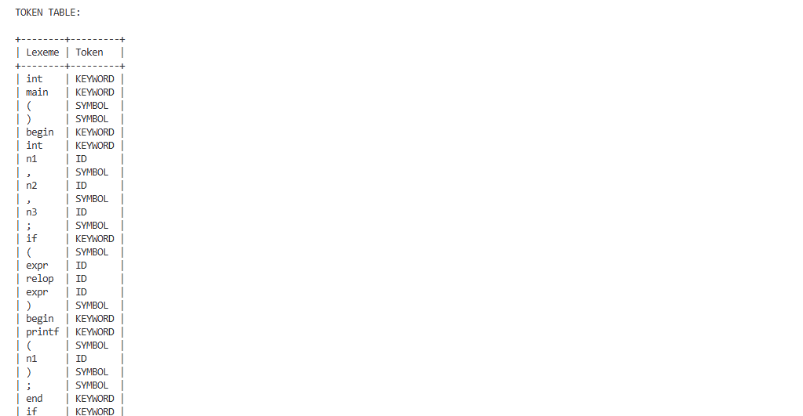 
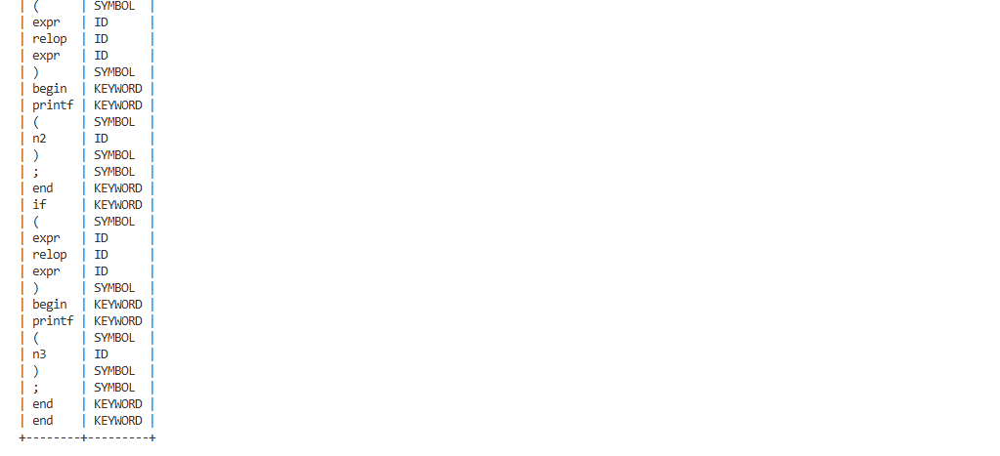 

🔹 Grammar

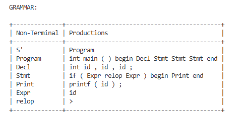

🔹FIRST & FOLLOW 

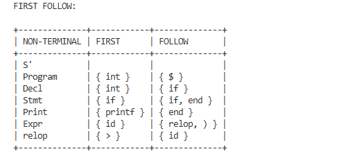 

🔹LR(0) States

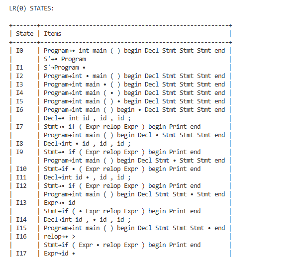
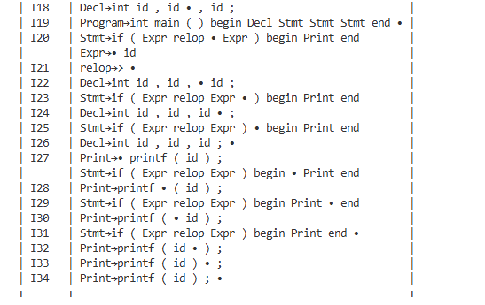

🔹 SLR Parsing Table

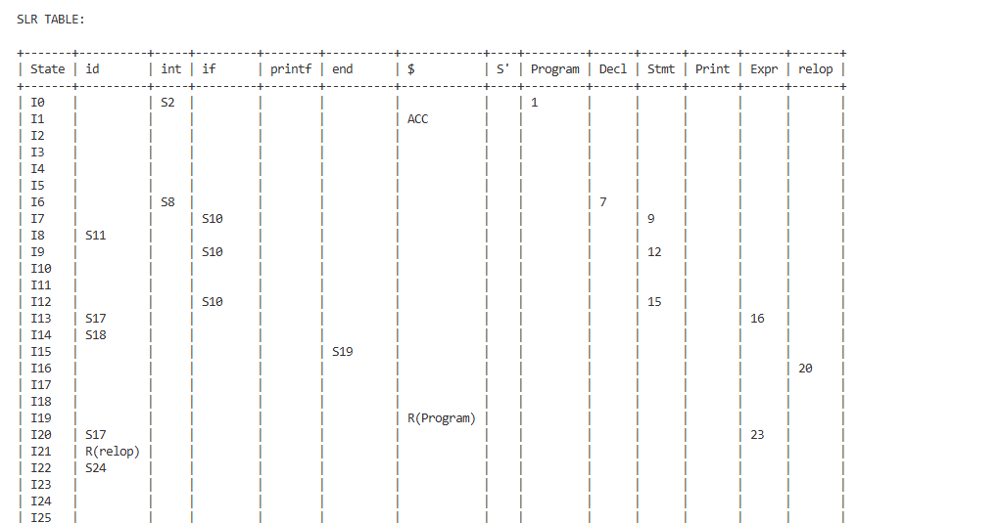 
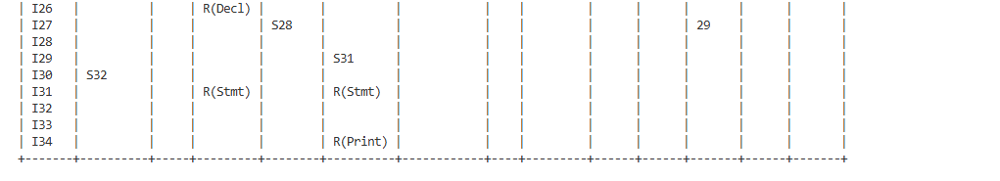 

🔹 Parsing Steps (ACCEPTED Case)

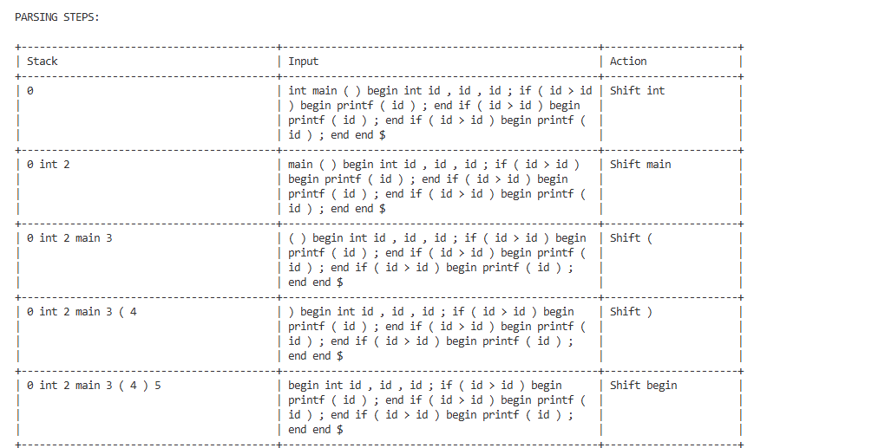
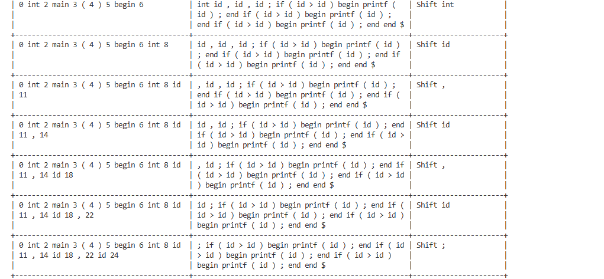 
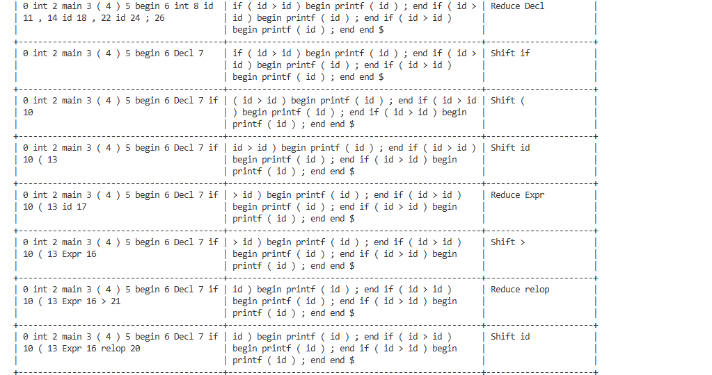
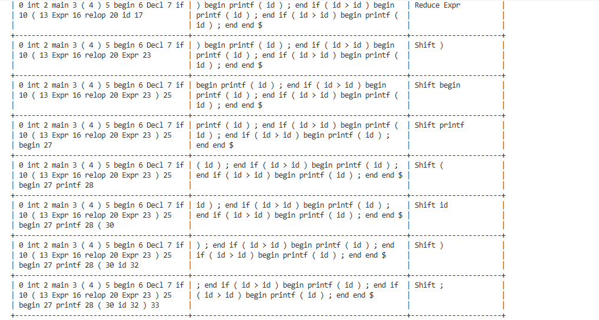 
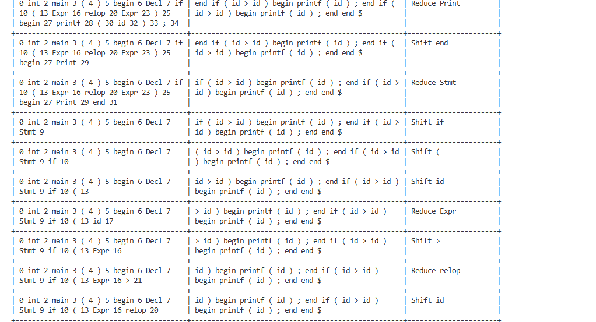 
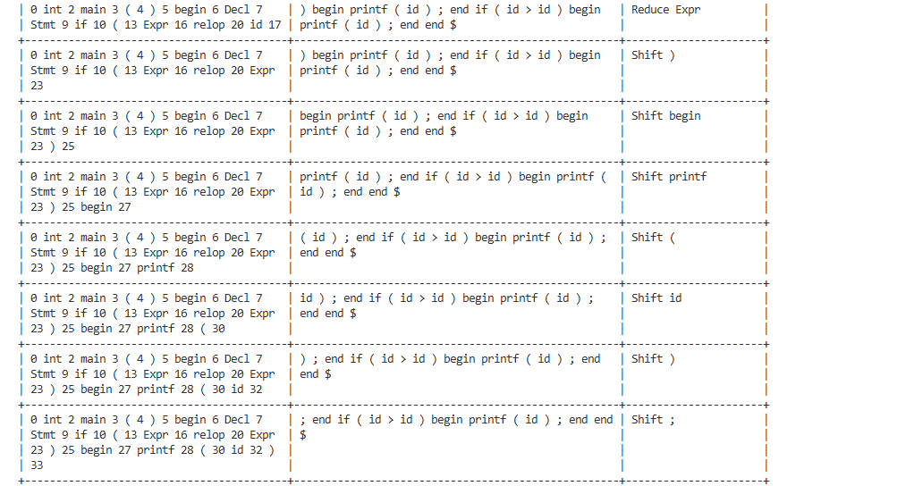
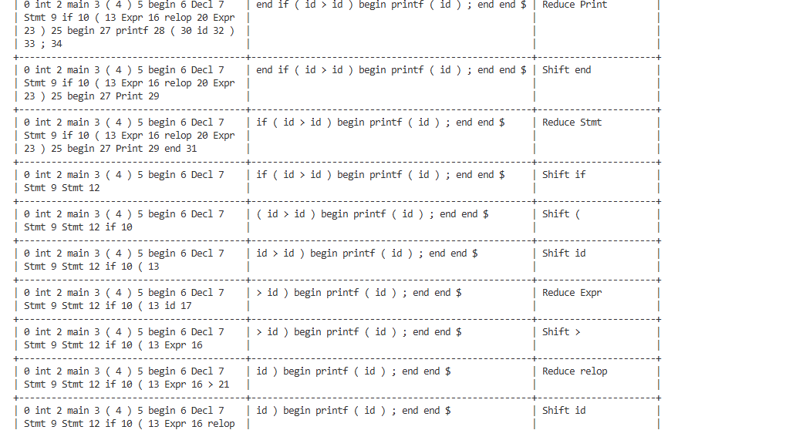 
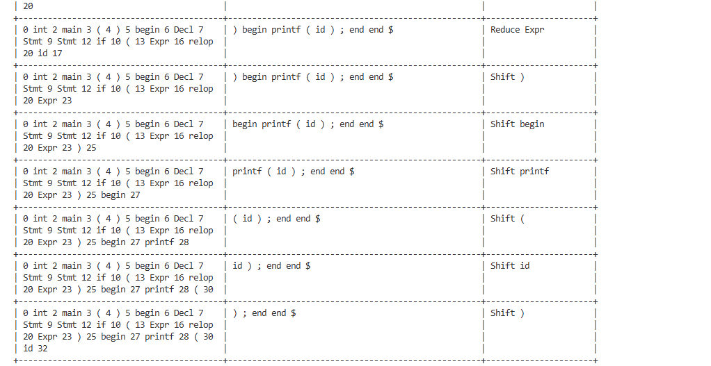
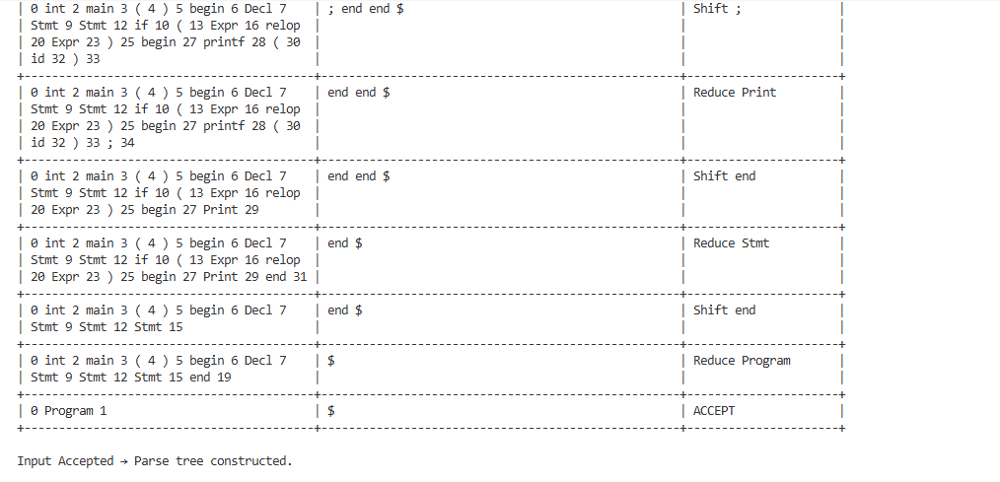

🔹 Parse Tree

 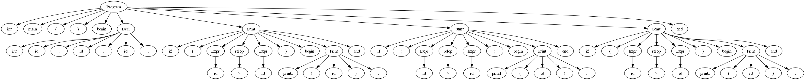
 
🔹 REJECTED Case & Parse Tree

 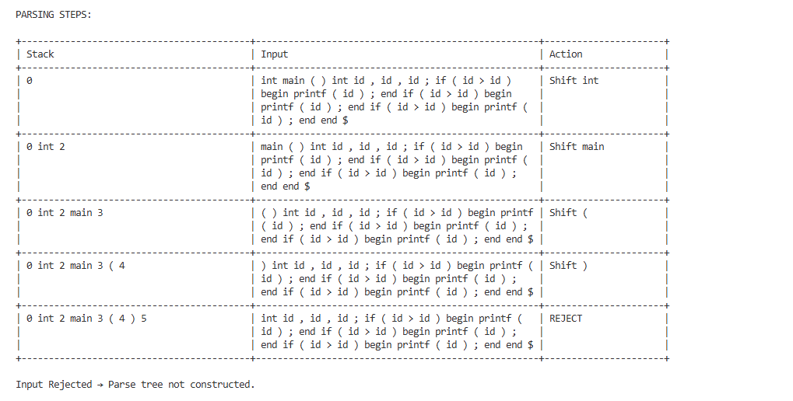

## 📌 As shown in the results section the program clearly demonstrates both accepted and rejected parsing cases with detailed step tracing.

## 🎓 Learning Outcomes

->Understanding of compiler front-end design

->Practical implementation of SLR parsing

->Hands-on experience with:

->DFA

->Parsing tables

->Grammar validation

->Visualization of syntax using parse trees

## 📚 References

1. Compilers: Principles, Techniques, and Tools – Aho et al.

2. GeeksforGeeks – Compiler Design

3. TutorialsPoint – Compiler Design

4. Python Documentation

## 📌 Conclusion

This project successfully demonstrates how lexical analysis and SLR parsing work together to validate program structure. It provides a clear, step-by-step visualization of parsing and highlights how compilers process code internally.
