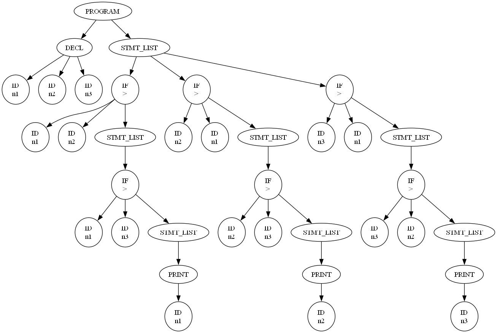

# Largest Number Mini Compiler

## 📌 Introduction

This project implements a **mini compiler front-end in Python** for a simple hypothetical language. It performs lexical analysis, parsing, Abstract Syntax Tree (AST) generation, semantic analysis, and interpretation to determine the **largest of three numbers using if statements**.

The project also includes **AST visualization** using Graphviz for better understanding of program structure.

## 👩‍💻 Authors

Sharanya Aithal KS


## 🎯 Features

* Lexical Analysis (Tokenization)
* Recursive Descent Parser
* Abstract Syntax Tree (AST) Generation
* Semantic Analysis (Symbol Table + Type Checking)
* Interpreter (Execution of program)
* Graphical AST Visualization using Graphviz
* User input support for dynamic execution


## 🛠️ Technologies Used

* Python
* Compiler Design Concepts
* Graph Visualization using Graphviz


## 🧠 Problem Statement

Design a compiler (Lexical and Parser phase) for a hypothetical language to find the largest number using if statements.

### Sample Input Program

```text
int main()
begin
int n1, n2, n3;
if (n1 > n2)
begin
    if (n1 > n3)
    begin
        printf(n1);
    end
end
if (n2 > n1)
begin
    if (n2 > n3)
    begin
        printf(n2);
    end
end
if (n3 > n1)
begin
    if (n3 > n2)
    begin
        printf(n3);
    end
end
end
```


## ⚙️ How It Works

### 1. Lexical Analysis

Converts source code into tokens such as keywords, identifiers, operators, and symbols.

### 2. Parsing

Uses a recursive descent parser to validate syntax and build the AST.

### 3. AST Generation

Represents the logical structure of the program in a tree format.

### 4. Semantic Analysis

* Builds a symbol table
* Checks for undeclared variables
* Ensures type consistency

### 5. Interpretation

Executes the AST and produces the final output.


## ▶️ How to Run

### Step 1: Install Python

Download from:
https://www.python.org/

### Step 2: Install Graphviz

Download and install:
https://graphviz.org/download/

Add this to PATH if required:

```
C:\Program Files\Graphviz\bin
```

### Step 3: Install Python Package

```
pip install graphviz
```

### Step 4: Run the Program

```
py mini_compiler.py
```


## 💻 Example Execution

```
Enter value for n1: 10
Enter value for n2: 25
Enter value for n3: 15

EXECUTION:
Output: 25
```
## 🖥️ Program Output

<p align="center">
  
</p>


## 🌳 AST Visualization

The program generates a graphical representation of the Abstract Syntax Tree:

* File generated: `AST_Output.png`
* Automatically opens after execution

The Abstract Syntax Tree (AST) generated by the compiler is shown below:

<p align="center">
  
</p>
This visualization is generated automatically using Graphviz and represents the hierarchical structure of the parsed program.


This visualization helps in understanding the hierarchical structure of the program.


## 📊 Output

* Parse Tree (text format)
* Symbol Table
* Execution Result
* Graphical AST


## 🚀 Key Concepts Demonstrated

* Compiler Design Phases
* Tokenization
* Recursive Descent Parsing
* Tree Data Structures
* Symbol Table Management
* Interpretation of Code


## 💡 Conclusion

This project demonstrates the working of a compiler front-end along with execution. It simplifies core compiler design concepts and provides a visual understanding using AST representation.


